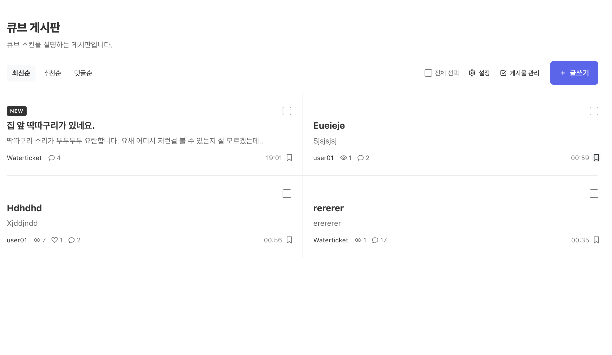

# cube — 카드 피드형 board 스킨



설치 위치 : `modules/board/skins/cube`

## 디렉토리

```
lib/       출력 없음. boot.blade.php가 config → columns → url → icons 순으로 include
layout/    페이지 셸 (assets/open/close)
list/      목록 화면
read/      글 상세
comment/   댓글 (comment.html 진입점 포함)
form/      글쓰기/삭제/비밀번호 등 나머지 진입 템플릿이 공유하는 조각
ui/        여러 화면이 함께 쓰는 조각 (pagination 등)
css/       00-tokens → 90-responsive, 번호로 로드 순서 고정
js/        cube.core / list / action / ui
```